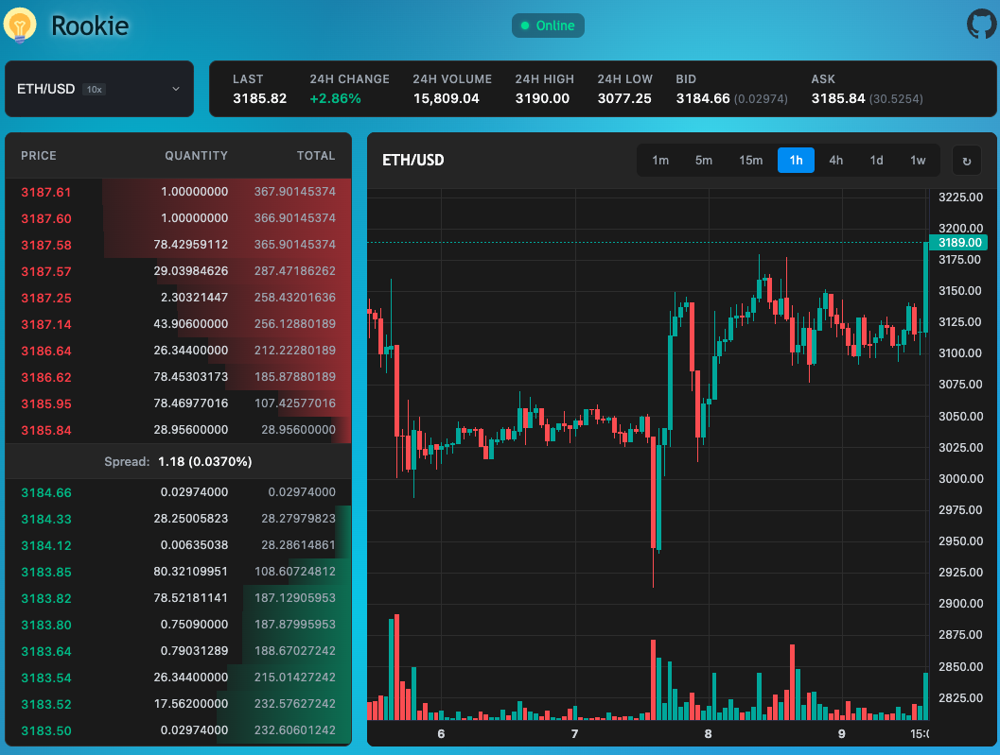

# Rookie Trader

A simple exchange built on top of the Kraken API.



## 📖 Overview

Rookie Trader is a real-time cryptocurrency trading platform that demonstrates modern web application architecture through a fully-featured monorepo. The application connects to Kraken's WebSocket and REST APIs to provide live market data, order books, price charts, and trading pair information.

### Key Features

- **Real-time Market Data**: Live order book updates, ticker information, and price feeds via WebSocket
- **Interactive Price Charts**: OHLC (candlestick) data visualization for market analysis
- **Trading Pair Management**: Browse and select from all available Kraken trading pairs
- **System Status Monitoring**: Real-time exchange status and health indicators
- **Multi-Bundler Support**: Same application built with Vite, Webpack, and ESBuild
- **Component Library**: Isolated, reusable UI components developed with Storybook

### TODO

- Private subscriptions and endpoints (spot trading)

### Application Architecture

The app-core package implements a clean, layered architecture following Domain-Driven Design principles:

#### **Domain Layer** (`domain/`)

Rich domain models with encapsulated business logic:

- `TradingPair`: Trading pair with validation, fee calculation, and formatting
- `OrderBook`: Bid/ask levels with market depth analysis
- `Ticker`: Real-time price, volume, and market statistics
- `Candle`: OHLC data for charting and technical analysis
- `SystemStatus`: Exchange operational status tracking

#### **Service Layer** (`services/`)

External API integration with reactive patterns:

- `kraken-ws-service.ts`: WebSocket subscriptions (ticker, order book, OHLC, system status)
- `kraken-rest-service.ts`: REST API calls for trading pair metadata
- Built on RxJS observables with automatic reconnection and error handling

#### **State Management** (`state/`)

Global application state with Zustand:

- Centralized trading pair selection
- Optimized updates to prevent unnecessary re-renders

#### **Data Mapping** (`mappers/`)

DTO-to-domain transformations:

- Converts raw Kraken API responses to typed domain models
- Handles incremental updates (e.g., merging order book deltas)

#### **Hooks Layer** (`hooks/`)

Business logic React hooks that bridge services and UI:

- `use-order-book`: Subscribe to real-time order book with throttling
- `use-ticker`: Live price and volume updates
- `use-ohlc`: Historical candlestick data for charts
- `use-trading-pairs`: Load and filter available trading pairs
- `use-system-status`: Monitor exchange health

#### **Container Components** (`containers/`)

Smart components that connect hooks to presentational components:

- `OrderBookDisplayContainer`: Manages order book state and display
- `PriceChartContainer`: Handles OHLC data and chart rendering
- `TickerDisplayContainer`: Real-time price ticker integration
- `TradingPairSelectorContainer`: Trading pair selection interface
- `SystemStatusContainer`: Exchange status monitoring

#### **Presentation Layer** (`components/`)

Reusable UI components from `@repo/ui` package:

- Consumes domain models as props
- Pure, testable components with no business logic
- Developed in isolation using Storybook

### Technical Highlights

- **Type Safety**: 100% TypeScript with strict mode enabled
- **Reactive Programming**: RxJS for WebSocket stream management with retry logic
- **Performance Optimizations**: Throttled updates, memoization, and efficient re-render prevention
- **Testing**: Jest with React Testing Library for unit and integration tests
- **Kraken Integration**: Uses `ts-kraken` library for type-safe API communication

## 🚀 Tech Stack

- **Monorepo**: Managed with [Turborepo](https://turbo.build/) and [pnpm workspaces](https://pnpm.io/workspaces).
- **Languages**: 100% [TypeScript](https://www.typescriptlang.org/).
- **Frontend**: React.
- **Component Development**: [Storybook](https://storybook.js.org/) for UI component development and testing.
- **Bundlers**: Vite, Webpack, and ESBuild (demonstrating multiple build strategies).
- **Infrastructure**: AWS (CloudFormation) and Netlify.

## 🛠 Prerequisites

- **Node.js**: (Check `.nvmrc` for version)
- **pnpm**: `v10.18.0` or higher

## 🏁 Getting Started

1. **Install dependencies:**

   ```bash
   pnpm install
   ```

2. **Environment Setup:**
   Copy the example environment file:

   ```bash
   cp .env.example .env
   ```

3. **Start Development Server:**
   To start all apps:

   ```bash
   pnpm dev
   ```

   To start a specific app (e.g., using vite):

   ```bash
   BUNDLER=app-vite pnpm dev:app
   ```

## 📂 Project Structure

### Apps

- **`app-esbuild`**: Main application bundled with ESBuild.
- **`app-vite`**: Main application bundled with Vite.
- **`app-webpack`**: Main application bundled with Webpack.
- **`ui-storybook`**: Storybook development environment for the UI library.

### Packages

- **`app-core`**: Core React application logic (developed as a library).
- **`commons`**: Shared utility library (built with tsup).
- **`dev-tools`**: Development utilities and shared configurations.
- **`@repo/ui`**: Shared React component library.
- **`@repo/eslint-config`**: Shared ESLint configurations.
- **`@repo/typescript-config`**: Shared TypeScript configurations.

### Infrastructure

- **`infra/aws`**: CloudFormation templates for AWS deployment (CloudFront, S3, ACM).
- **`infra/netlify`**: Scripts and tools for Netlify deployment.

## 📜 Scripts

### Development

- `pnpm dev`: Start all applications in development mode.
- `pnpm dev:app`: Start a specific app (requires `BUNDLER` env var, e.g., `BUNDLER=app-vite pnpm dev:app`).
- `pnpm dev:ui`: Start Storybook development server.

### Preview

- `pnpm preview`: Preview all production builds locally.
- `pnpm preview:app`: Preview a specific app build (requires `BUNDLER` env var).
- `pnpm preview:ui`: Preview Storybook build.

### Build

- `pnpm build`: Build all apps and packages.
- `pnpm build:app`: Build a specific app (requires `BUNDLER` env var).
- `pnpm build:ui`: Build Storybook.

### Code Quality

- `pnpm lint`: Run ESLint across the workspace.
- `pnpm lint:app`: Lint a specific app and its dependencies (requires `BUNDLER` env var).
- `pnpm lint:ui`: Lint Storybook and its dependencies.
- `pnpm check:type`: Run TypeScript type checking.
- `pnpm check:format`: Check code formatting with Prettier.
- `pnpm format:code`: Format code with Prettier.

### Testing

- `pnpm test`: Run all tests.
- `pnpm test:watch`: Run tests in watch mode.

### Dependencies Management

- `pnpm check:dependencies`: Check dependency versions are in sync with syncpack.
- `pnpm format:dependencies`: Auto-fix dependency issues with sherif.

### Quality Checks

- `pnpm quality-checks`: Run full quality suite (dependency check, type check, lint, and tests).

### Deployment

- `pnpm deploy:aws`: Build and deploy to AWS (requires `BUILD_ENVIRONMENT` env var).
- `pnpm deploy:netlify`: Build and deploy to Netlify.

### Maintenance

- `pnpm clear:cache`: Clear pnpm cache and all node_modules directories.
- `pnpm clear:output`: Clear build outputs across all packages.

## 🐛 Debugging

To debug the application in Chrome:

1. Open Chrome with remote debugging enabled:

   ```bash
   /Applications/Google\ Chrome.app/Contents/MacOS/Google\ Chrome --remote-debugging-port=9222 --user-data-dir=remote-debug-profile
   ```

   _(Note: Data will be saved to the 'remote-debug-profile' directory)_

2. Use the VS Code debugger to attach to the process.
   See [VS Code React Debugging](https://code.visualstudio.com/docs/nodejs/reactjs-tutorial#_debugging-react) for more details.
