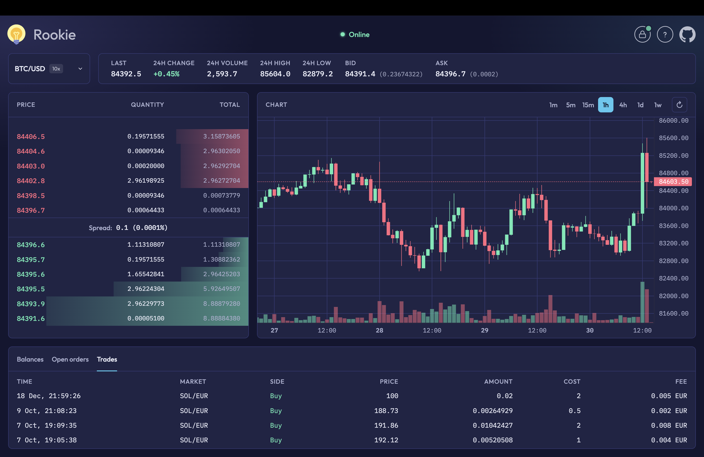

# Rookie Trader

Live Kraken market data and your Kraken account in one browser page, built as a TypeScript monorepo.



## 📖 Overview

Pick a market to see its live ticker, order book and candlestick chart. Sign in with a Kraken API key to see your balances, open orders and recent trades. The same app is built with Vite, Webpack and ESBuild, and its UI components are developed in Storybook.

Placing and cancelling orders is not built yet.

- [Features](docs/features.md): what each part of the page shows and where its data comes from.
- [Architecture](docs/architecture.md): code layers, live data handling, and how sign-in works.

## 🚀 Tech Stack

- **Monorepo**: Managed with [Turborepo](https://turbo.build/) and [pnpm workspaces](https://pnpm.io/workspaces).
- **Languages**: 100% [TypeScript](https://www.typescriptlang.org/).
- **Frontend**: React.
- **Component Development**: [Storybook](https://storybook.js.org/) for UI component development and testing.
- **Bundlers**: Vite, Webpack, and ESBuild (demonstrating multiple build strategies).
- **Infrastructure**: AWS (CloudFormation) and Netlify.

## 🛠 Prerequisites

- **Node.js**: (Check `.nvmrc` for version)
- **pnpm**: `v11.7.0` or higher

## 🏁 Getting Started

1. **Install dependencies:**

   ```bash
   pnpm install
   ```

2. **Generate agent rules** (Claude Code, Cursor) from the committed `.rulesync/`:

   ```bash
   pnpm rules:generate
   ```

3. **Environment Setup:**
   Copy the example environment file:

   ```bash
   cp .env.example .env
   ```

4. **Start Development Server:**
   To start all apps:

   ```bash
   pnpm dev
   ```

   To start a specific app (e.g., using vite):

   ```bash
   BUNDLER=app-vite pnpm dev:app
   ```

## 📂 Project Structure

### Apps

- **`app-esbuild`**: Main application bundled with ESBuild.
- **`app-vite`**: Main application bundled with Vite.
- **`app-webpack`**: Main application bundled with Webpack.
- **`ui-storybook`**: Storybook development environment for the UI library.

### Packages

- **`app-core`**: Core React application logic (developed as a library).
- **`commons`**: Shared utility library (built with tsup).
- **`dev-tools`**: Development utilities and shared configurations.
- **`@repo/ui`**: Shared React component library.
- **`@repo/eslint-config`**: Shared ESLint configurations.
- **`@repo/typescript-config`**: Shared TypeScript configurations.

### Infrastructure

- **`infra/aws`**: CloudFormation templates for AWS deployment (CloudFront, S3, ACM).
- **`infra/netlify`**: Scripts and tools for Netlify deployment.

## 📜 Scripts

### Development

- `pnpm dev`: Start all applications in development mode.
- `pnpm dev:app`: Start a specific app (requires `BUNDLER` env var, e.g., `BUNDLER=app-vite pnpm dev:app`).
- `pnpm dev:ui`: Start Storybook development server.

### Preview

- `pnpm preview`: Preview all production builds locally.
- `pnpm preview:app`: Preview a specific app build (requires `BUNDLER` env var).
- `pnpm preview:ui`: Preview Storybook build.

### Build

- `pnpm build`: Build all apps and packages.
- `pnpm build:app`: Build a specific app (requires `BUNDLER` env var).
- `pnpm build:ui`: Build Storybook.

### Code Quality

- `pnpm lint`: Run ESLint across the workspace.
- `pnpm lint:app`: Lint a specific app and its dependencies (requires `BUNDLER` env var).
- `pnpm lint:ui`: Lint Storybook and its dependencies.
- `pnpm check:type`: Run TypeScript type checking.
- `pnpm check:format`: Check code formatting with Prettier.
- `pnpm format:code`: Format code with Prettier.

### Testing

- `pnpm test`: Run all tests.
- `pnpm test:watch`: Run tests in watch mode.

### Dependencies Management

- `pnpm check:dependencies`: Check dependency versions are in sync with syncpack.
- `pnpm format:dependencies`: Auto-fix dependency issues with sherif.

### Quality Checks

- `pnpm quality-checks`: Run full quality suite (dependency check, type check, lint, and tests).

### Deployment

- `pnpm deploy:aws`: Build and deploy to AWS (requires `BUILD_ENVIRONMENT` env var).
- `pnpm deploy:netlify`: Build and deploy to Netlify.

### Agent Rules

- `pnpm rules:fetch`: Refresh `.rulesync/` from the `andrej-kolic/playbook` repo.
- `pnpm rules:generate`: Write `.claude/rules/` and `.cursor/rules/` (git-ignored) from `.rulesync/`.
- `pnpm rules:install`: Fetch, then generate.

### Maintenance

- `pnpm clear:cache`: Clear pnpm cache and all node_modules directories.
- `pnpm clear:output`: Clear build outputs across all packages.

## 🐛 Debugging

To debug the application in Chrome:

1. Open Chrome with remote debugging enabled:

   ```bash
   /Applications/Google\ Chrome.app/Contents/MacOS/Google\ Chrome --remote-debugging-port=9222 --user-data-dir=remote-debug-profile
   ```

   _(Note: Data will be saved to the 'remote-debug-profile' directory)_

2. Use the VS Code debugger to attach to the process.
   See [VS Code React Debugging](https://code.visualstudio.com/docs/nodejs/reactjs-tutorial#_debugging-react) for more details.
